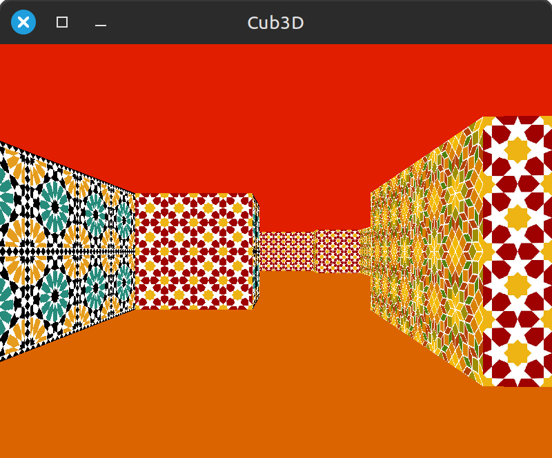

# 42 Cursus

## Cub3D 🎮

Cub3D is a 42 school team project in which you will create a dynamic view inside a 3D maze. 




Using the [Codam library](https://github.com/codam-coding-college/MLX42), we must implement raycasting in the style of the famous [Wolfenstein 3D game](https://www.retrogames.cz/play_408-DOS.php).   

<p float="left">
  
  
</p>


### Features
* Realistic 3D graphical representation of a maze.
* Smooth window management (e.g., changing windows, minimizing).
* Different wall textures based on orientation (North, South, East, West).
* Customizable floor and ceiling colors.
* Player movement using W, A, S, D keys.
* Interactive minimap.
* Mouse-based point of view rotation.

### Map format
```c
NO ./path_to_the_north_texture
SO ./path_to_the_south_texture
WE ./path_to_the_west_texture
EA ./path_to_the_east_texture
F 220,100,0
C 225,30,0
1111111111111111111111111
1000000000110000000000001
1011000001110000000000001
100100000000000000000000111111111
11111111101100N001110000000000001
100000000011000001110111111111111
111111111111111111111111111111111
```
1 and spaces - Walls  
0 - Floor  
Either N, S, W or E for the character.  

## How to use:
1. Clone the repository:
```c
git clone https://github.com/aldferna/Cub3D.git
```
2. Access the MLX42 directory - remove the build directory - rebuild it:
```c
cd MLX42
rm -rf build
cmake -B build
cmake --build build -j4
```
3. Compile it:
```c
make
```
4. Execute with a valid map:
```c
./cub3D map.cub
```

##
Made in collaboration with [Luis Martín](https://github.com/luuismrtn).
